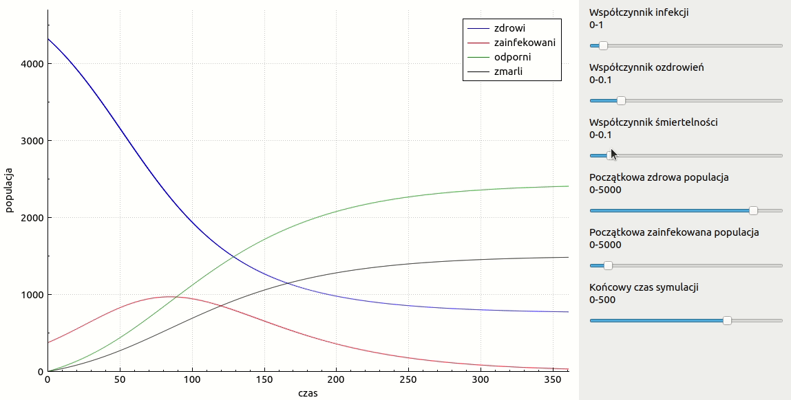

# Visualization of population dynamics during the pandemic 
based on [SIRD model](https://en.wikipedia.org/wiki/Compartmental_models_in_epidemiology#The_SIRD_model)

## Technology
GUI created in C++ with Qt library. [QCustomPlot](https://www.qcustomplot.com/index.php/introduction) was used to generate plots.

## Solved ODE system
  
  
  
  

where :  
S - healthy population susceptible to infection  
I - infected population  
R - a recovered, resistant population  
D - dead population  
 - infection rate  
 - recovery rate  
 - mortality rate  

### Solving method
First order Runge Kutta [method](https://en.wikipedia.org/wiki/Runge%E2%80%93Kutta_methods) (the Euler [method](https://en.wikipedia.org/wiki/Euler_method)) is used to solve the above ODE system

## Result

